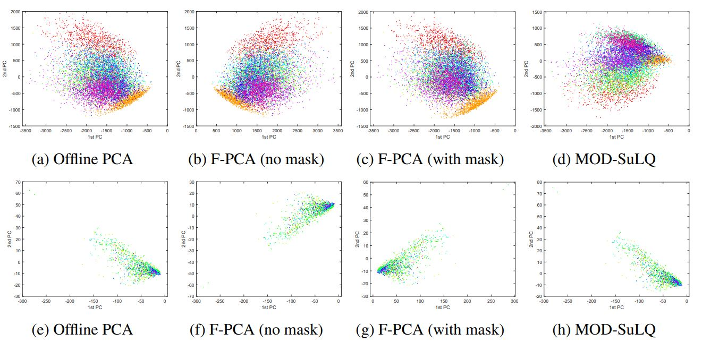
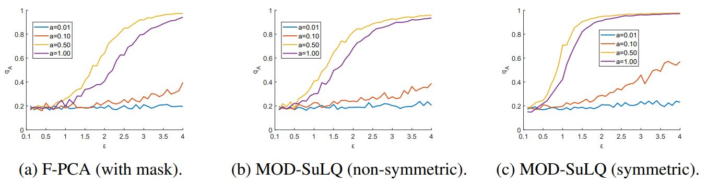
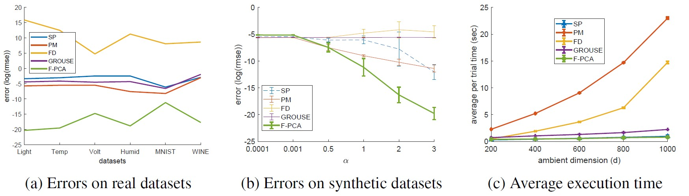
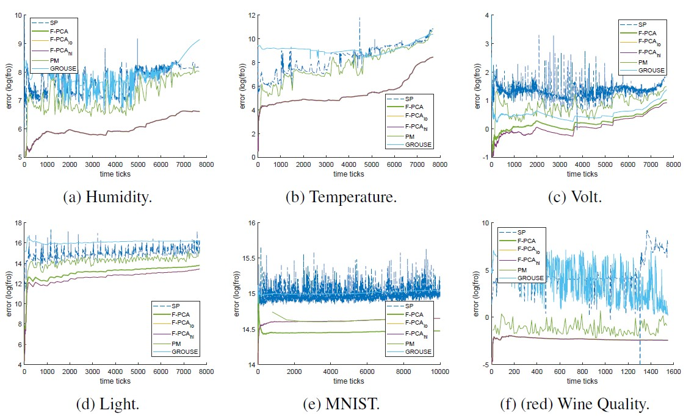
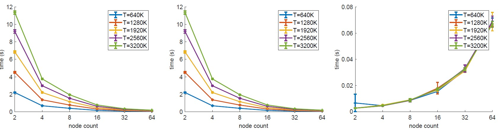

# Federated Principal Component Analysis Revisited!

In this work, we present a federated, asynchronous, and (ε, δ)-differentially  private algorithm for PCA in the 
memory-limited setting. Our algorithm incrementally computes local model updates using a streaming procedure and 
adaptively estimates its `r` leading principal components when only `O(dr)` memory is available with `d` being 
the dimensionality of the data. We guarantee differential privacy via an  input-perturbation scheme in which  the 
covariance matrix of a dataset `X` of <code>R<sup>d x n</sup></code> is perturbed with a non-symmetric random Gaussian 
matrix with variance in <code>O((d/n)<sup>2</sup> log(d))</code>, thus improving upon the state-of-the-art. Furthermore, 
contrary to previous federated or distributed algorithms for PCA, our algorithm is also invariant to permutations in 
the incoming data, which provides robustness against straggler or failed nodes.  Numerical simulations show that, while 
using limited-memory, our algorithm exhibits performance that closely matches or outperforms traditional non-federated 
algorithms, and in the absence of communication latency, it exhibits attractive horizontal scalability.

For more details, please check out the full paper [here](https://arxiv.org/abs/1907.08059).

# Requirements

The code is generally self-contained and all datasets are included or generated thus, in theory, just having `Matlab`  
installed should be more than enough. It has to be noted though that due the recent `Matlab` changes on how it handles 
character and string arrays you should use a recent version of it -- the code was developed and tested in `R2020a` 
(build `9.8.0.1380330`) but was tested also on versions `2018{a,b}` and `2019{a,b}`; moreover, to address different OSes, 
care has been taken so that this code runs without any problems both on Windows-based machines and Unix-based ones.

# Comparisons

In this instance we perform comparisons using both synthetic and real datasets with and without input perturbation masks. 
All our experiments were computed on a workstation using an AMD TR 1950X CPU with 16 cores at 4.0GHz, 128 GB 3200 MHz 
DDR4 RAM, and Matlab `R2020a` (build `9.8.0.1380330`), as mentioned previously.

## With perturbation masks

Our main goal in this bit of the evaluation is to gauge how close the performance of our scheme is to [MOD-SuLQ][6].

### Real datasets

To quantify the loss with the application of differential private that our scheme has we 
compare the quality of the projections using the [MNIST][7] and [Wine quality][8] datasets which contain, respectively, 
10000 labelled images of handwritten digits (test-set) and physicochemical data for 6498 variants of red and white wine.
To retrieve our baseline we performed the full-rank PCA on the MNIST and (red) Wine datasets and retrieved the first and 
second principal components. Then, on the same datasets, we applied Federated PCA (F-PCA) with rank estimate `r=6`, 
block size `b=25`, and differential privacy budget of `(ε, δ)=(0.1, 0.1)`. We also used MOD-SuLQ using the same rank 
and DP budget as we did for F-PCA.

It can be seen from the figure below, that in all cases, F-PCA learnt the principal subspace of 
Offline PCA (up to a rotation) and managed to preserve the underlying structure of the data. In fact, in most 
instances it even performed better than MOD-SuLQ, especially when the sample complexity increases.
We note that rotations are expected as the guarantees for our algorithm hold up to a unitary transform.
For more details, please refer to the full text.



### Utility loss over synthetic datasets

To evaluate the utility loss with respect to the privacy-accuracy trade-off we fix `δ=0.01` and we plot the 
utility loss <code>q<sub>A</sub></code> across a variety of `ε = 0.1:0.1:4` values. The utility loss 
<code>q<sub>A</sub></code> is defined as the dot product of the first principal components of the method being 
evaluated against the offline, full rank PCA. We perform this evaluation for F-PCA, symmetric and 
non-symmetric MOD-SuLQ. 

The results of this experiment are shown in below where we see that a larger `ε` value increases the utility, 
but at the cost of lower DP. Quantitatively speaking, our experiments show that the more uniform the spectrum is, 
the harder it is to guarantee DP and preserve the utility regardless of method. 



## Without perturbation masks

We perform the comparison against similar methods which compute in part or 
fully an approximate *memory-limited, streaming r-truncated PCA*. To make the 
comparison fair we use the single node version of F-PCA when running this experiment.
Finally, we report the resulting subspace quality, and the frobenious norm error 
of each method which clearly show that F-PCA exhibits state-of-the-art performance. 

 * Federated PCA (https://arxiv.org/abs/1907.08059)
 * Power Method (https://arxiv.org/pdf/1307.0032.pdf)
 * Frequent Directions (https://arxiv.org/abs/1501.01711.pdf)
 * Robust Frequent Directions (https://arxiv.org/pdf/1705.05067.pdf)
 * GROUSE (https://arxiv.org/pdf/1702.01005.pdf)
 * SPIRIT (https://dl.acm.org/citation.cfm?id=1083674)

Note that the rank adjusting experiments are performed using only SPIRIT; this is 
because it is the only method that has an explicit rank estimation mechanism via energy 
thresholding. Finally, note that F-PCA is in spirit similar to [MOSES][5] and inherits 
most of its properties and thus no further comparison is being made against it.

Below we can see the overall resulting errors on synthetic and real datasets as well as their execution times; it can 
be clearly seen that F-PCA performs favourably while besting or being very close to SPIRIT in terms of its execution 
time.



The final figure we show for the evaluation without perturbation masks is the frobenious norm error over time for all 
the *real* datasets we evaluated; again, we can see that F-PCA performs favourably.



# Federated experiments

We performed a federated experiment by structuring the potential nodes in a tree structure as described in our paper.
Then, we measured the total execution time as well as the individual times required for PCA computation and merges - 
note that the times shown below are *amortised* times, meaning that we assume enough resources are available and each 
problem segment is starting to be processed immediately. The results below show that in the presence of the necessary 
resources to compute each sub-problem F-PCA exhibits an attractive scaling curve.



# Running the evaluation scripts

Running the test scripts is fairly simple -- just `cd` to the cloned `federated_pca` directory within `Matlab` and then 
run the respective test files - brief explanation of what they do is shown below:

 * [`test_dp_variance_landscape.m`](test_dp_variance_landscape.m): tests DP-mask variance landscape for F-PCA and MOD-SuLQ.
 * [`test_execution_time.m`](test_execution_time.m): performs F-PCA speed tests.
 * [`test_fpca_federated.m`](test_fpca_federated.m): performs the federated test.
 * [`test_fpca_mask_mnist_wine.m`](test_fpca_mask_mnist_wine.m): performs the differential privacy evaluation on MNIST and Wine datasets.
 * [`test_fpca_real.m`](test_fpca_real.m): performs the real dataset evaluation.
 * [`test_fpca_synthetic.m`](test_fpca_synthetic.m): performs the synthetic dataset evaluation.
 * [`test_subspace_merge.m`](test_subspace_merge.m): performs the subspace merging tests.
 * [`test_time_order.m`](test_time_order.m): performs the time order independence tests.
 * [`test_utility_loss.m`](test_utility_loss.m): performs utility evaluation tests for F-PCA vs MOD-SuLQ.
 * [`test_var_vs_dB.m`](test_var_vs_dB.m): performs `d/B` ratio test to evaluate the sample complexity required (helped with the proof).

Please note that you can tweak the relevant section values  if you want to run slightly different experiments but if 
you want to reproduce the results in the paper please use the values specified in the paper (or code comments).

# Code Organisation

The code is self-contained and a brief explanation of what each file does follows. The 
files are ordered in (descending) lexicographical order:
 * `beta_xn`: Used to compute the xn values for the test d/B ratio.
 * `eval_fpca_real`: wrapper function to run all fpca real
 * `fd.m`: Implementation of Frequent Directions.
 * `fd_rotate_sketch.m`: helper method for both Frequent Directions methods.
 * `fdr.m`: Implementation of Robust Frequent Directions.
 * `fpca_config.m`: Function that ensures all of f-pca parameters are valid.
 * `fpca_edge.m`: Runs the local updates for the federated FPCA scheme.
 * `fpca_edge_errors.m`: Compute the errors of F-PCA in one function.
 * `fpca_rank_adjust.m`: Perform rank adjust for F-PCA.
 * `fpca_stream_mod_sulq.m`: Streaming MOD-SuLQ for F-PCA.
 * `fpca_subspace_merge.m`: Merges two subspaces of equal or different ranks.
 * `grams.m`: Gram-Schmidt orthogonalization for a given matrix.
 * `gm_orth.m`: Vectorised Gram-Schmidt orthonormoalisation.
 * `grouse.m`: Original `GROUSE` algorithm code as provided from its authors.
 * `mitliag_pm.m`: Implementation of Mitliagkas Power Method for Streaming PCA.
 * `mod_sulq.m`: An implementation of Mod-SuLQ.
 * `mod_sulq_variance.m`: Generate mod-sulq variance for a given setting.
 * `my_grouse.m`: Wrapper to run `grouse.m` which sets execution parameters (as seen [here][2]).
 * `my_toc.m`: function that processes the `toc` with better formatting.
 * `print_fig.m`: Prints figures in different formats (i.e.: `pdf`, `png`, and `fig`).
 * `README.md`: This file, a "brief" README file.
 * `setup_vars.m`: sets up the environment variables.
 * `spectrum_adaptive.m`: plot helper for the singular value approximation vs ground truth.
 * `SPIRIT.m`: Original `SPIRIT` algorithm as provided from its authors (as seen [here][1]).
 * `ssvdr.m`: Streaming r-truncated SVD. 
 * `ssvdr_block_update.m`: Update the estimate of r-truncated SVD. 
 * `ssvdr_rank_adjust.m`: Performs the rank adjust of ssvdr.
 * `stream_mod_sulq.m`:  Perform Streaming MOD-SuLQ.
 * `stream_mod_sulq_mask.m`: Generate the perturbation mask for block B.
 * `stream_mod_sulq_variance.m`: Generate variance (β) for streaming MOD-SuLQ.
 * `synthetic_data_gen.m`: function which generates a matrix with random vectors from a variety of distributions.
 * `test_dp_variance_landscape.m`: tests DP-mask variance landscape for F-PCA and MOD-SuLQ.
 * `test_execution_time.m`: performs F-PCA speed tests.
 * `test_fpca_federated.m`: performs the federated tests.
 * `test_fpca_mask_mnist_wine.m`: performs the differential privacy evaluation on MNIST and Wine datasets.
 * `test_fpca_real.m`: performs the real dataset evaluation.
 * `test_fpca_synthetic.m`: performs the synthetic dataset evaluation.
 * `test_subspace_merge.m`: performs the subspace merging error tests and was used as a test-bed.
 * `test_time_order.m`: performs the time order invariance tests.
 * `test_utility_loss.m`: performs utility evaluation tests for F-PCA vs MOD-SuLQ.
 * `test_var_vs_dB.m`: performs `d/B` ratio test to evaluate the sample complexity required (helped with the proof).
 * `updateW.m`: helper function for SPIRIT, performs the update of the subspace for each datapoint.
 
# Plots

A number of plots are generated while running each test script comparison and for
convenience they are printed into a generated directory under the `graph` directory. Each 
directory is named using the current timestamp upon creation as its name, and the timestamp format 
follows the [ISO-8601][4] standard.

Additionally, the printing function is flexible enough to able to export in three commonly used formats 
concurrently -- namely `png`, `pdf`, and `fig` for easier processing. Of course, by toggling the appropriate 
flags printing to `pdf` and `fig` can be disabled thus saving space. For brevity these are the following:

```MatLab
% 'params' is assumed to be a valid structure
params = struct
% printing flags
params.pflag = 1;              % print resulting figures to ./graphs/
params.pdf_print = 0;          % print resulting figures as .pdf
params.fig_print = 1;          % print resulting figures as .fig

% later on use print_fig as:
print_fig(fig, title, params);
```
 
# License

This code is licensed under the terms and conditions of GPLv3 unless otherwise stated. 
The actual paper is governed by a separate license and the paper authors retain their 
respective copyrights.

# Acknowledgement

If you find our paper useful or use this code, please consider citing our work as such:

```
@misc{1907.08059,
    Author = {Andreas Grammenos and Rodrigo Mendoza-Smith and Cecilia Mascolo and Jon Crowcroft},
    Title = {Federated Principal Component Analysis},
    Year = {2020},
    Eprint = {arXiv:1907.08059},
}
```

# Disclaimer

THIS SOFTWARE IS PROVIDED BY THE COPYRIGHT HOLDERS AND CONTRIBUTORS "AS IS" 
AND ANY EXPRESS OR IMPLIED WARRANTIES, INCLUDING, BUT NOT LIMITED TO, THE 
IMPLIED WARRANTIES OF MERCHANTABILITY AND FITNESS FOR A PARTICULAR PURPOSE ARE 
DISCLAIMED. IN NO EVENT SHALL THE COPYRIGHT OWNER OR CONTRIBUTORS BE LIABLE FOR 
ANY DIRECT, INDIRECT, INCIDENTAL, SPECIAL, EXEMPLARY, OR CONSEQUENTIAL DAMAGES 
(INCLUDING, BUT NOT LIMITED TO, PROCUREMENT OF SUBSTITUTE GOODS OR SERVICES; 
LOSS OF USE, DATA, OR PROFITS; OR BUSINESS INTERRUPTION) HOWEVER CAUSED AND 
ON ANY THEORY OF LIABILITY, WHETHER IN CONTRACT, STRICT LIABILITY, OR TORT 
(INCLUDING NEGLIGENCE OR OTHERWISE) ARISING IN ANY WAY OUT OF THE USE OF THIS 
SOFTWARE, EVEN IF ADVISED OF THE POSSIBILITY OF SUCH DAMAGE.

[1]: http://www.cs.cmu.edu/afs/cs/project/spirit-1/www/
[2]: http://web.eecs.umich.edu/~girasole/grouse/
[3]: http://www.cs.albany.edu/~jhh/courses/readings/desphande.vldb04.model.pdf
[4]: https://en.wikipedia.org/wiki/ISO_8601
[5]: https://github.com/andylamp/moses
[6]: https://papers.nips.cc/paper/4565-near-optimal-differentially-private-principal-components.pdf
[7]: http://yann.lecun.com/exdb/mnist/
[8]: https://archive.ics.uci.edu/ml/datasets/wine+quality
